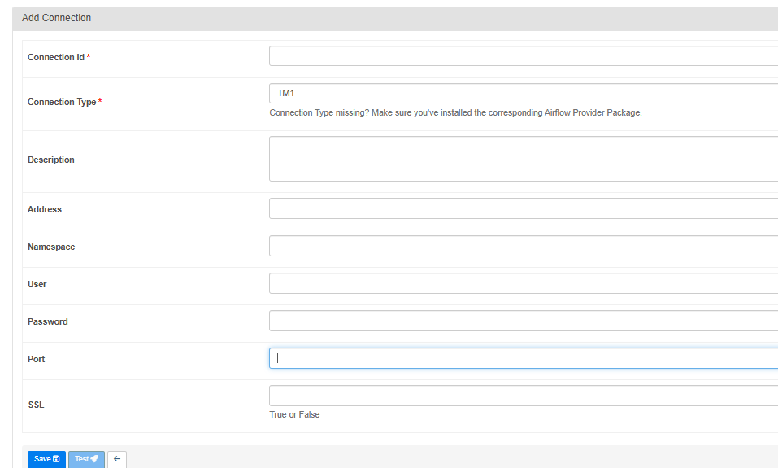

# airflow-provider-tm1


A package by Knowledgeseed and Cubewise that provides a hook to simplify the connection to the IBM Cognos TM1 / Planning Analytics REST API.

https://github.com/airflow-provider-tm1/airflow-provider-tm1

This repository builds on https://github.com/MariusWirtz/airflow-tm1 and https://github.com/scrambldchannel/airflow-tm1 which offer only Airflow 1.x compatibility, and upgrades the provider to ensure Airflow 2.x compatibility. Some parts and have been reused from https://github.com/scrambldchannel/airflow-provider-tm1 as well.

## Requirements

* Python 3.7+
* Airflow 2.3+
* TM1py 2.0+

## Development

```
python -m venv .env
source .env/bin/activate
python -m pip install -r requirements.txt
python -m build
```

To execute the automated test suite locally, you can leverage (https://github.com/nektos/act):

```
act -j build  -W .github/workflows/build-test.yml -s DUSERNAME=knowledgeseed -s DPASSWORD=<obtain access token to private DockerHub registry from KS>
```

## Installation

Install with pip `pip install airflow-provider-tm1`

## Usage

Create a connection in Airflow:

* **TM1 11 on-premise**: BaseURL (or Address+Port+SSL), User, Password
* **TM1 11 on IBM cloud**: BaseURL, Namespace, User. Password, Extras/async_requests_mode, Extras/verify 
* **TM1 12 PAaaS**:  BaseURL, User, Password, Extras/async_requests_mode, Extras/verify 
* **TM1 12 on-premise & Cloud Pak For Data**: BaseURL (or Address + Extras/instance + Extras/database), Extras/application_client_id, Extras/application_client_secret, User
* **TM1 12 on-premise with access token**:  BaseURL (or Address + Extras/instance + Extras/database), User, Extras/access_token, Extras/async_requests_mode, Extras/verify

Any other parameter accepted by the TM1py RestService constructor can also be added as key/value pairs in the Extras field.

For the exact parameterization of TM1Service and further examples, please check https://github.com/cubewise-code/tm1py



In your DAG file:

```python
from airflow_provider_tm1.operators.tm1_run_ti import TM1RunTIOperator

...

t1 = TM1RunTIOperator (
        task_id='t1',
        tm1_conn_id='tm1_conn',
        process_name='airflow_test_params_success_dag',
        tm1_params={'testParam1': 'testParamValue'},
        timeout=20,
        cancel_at_timeout=True
    )
```

This will attempt to connect to the TM1 server using the details provided and initialise an instance of the TM1Service class than be accessed at `airflow_provider_tm1.hooks.tm1.TM1Hook`

See [TM1py](https://github.com/cubewise-code/tm1py) for more details.

It's important to mention that TM1Py will execute TI process in asynchronous mode. The operator submits the request, receives the `async_id` from TM1 and starts polling the result using `async_id` until the response is retrieved or times out.
Timeout is defined in seconds, default value is 300 seconds. It's also important that Airflow-side timeout does not 
involve automatically the cancellation of the TI process. If `cancel_at_timeout` is set `True`, Airflow will make an attempt 
to cancel the long-running TI process.

For further examples, please see `tests_integration/dags` folder.

## Manual integration testing

Use `tests_integration/docker-compose.yaml` as a baseline, which spins up an Airflow including the TM1 provider and a base TM1 database to test against. Please note that `tm1-docker` image is properietary IBM product wrapped in Docker by Knowledgeseed and therefore it is only available internally for Knowledgeseed developers.

To obtain a licensed IBM TM1 database for testing or production purpose, please see https://www.ibm.com/topics/tm1 for further details.

## License

See [LICENSE](https://github.com/scrambldchannel/airflow-tm1/LICENSE)


